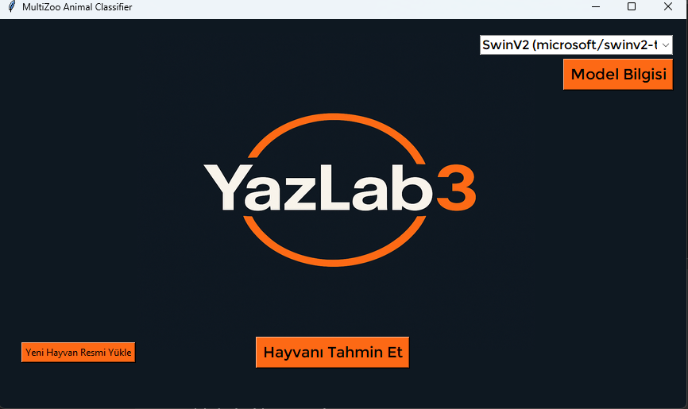
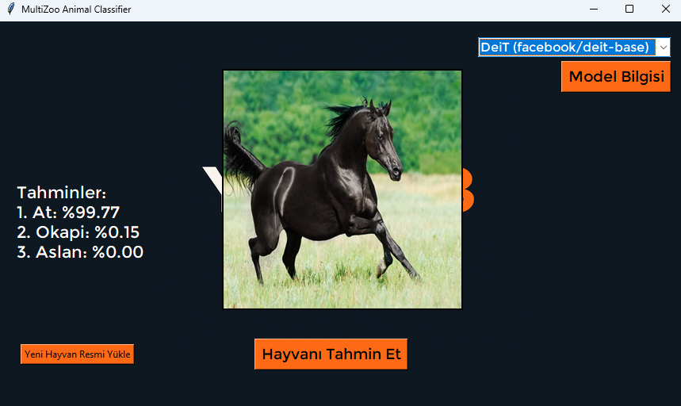
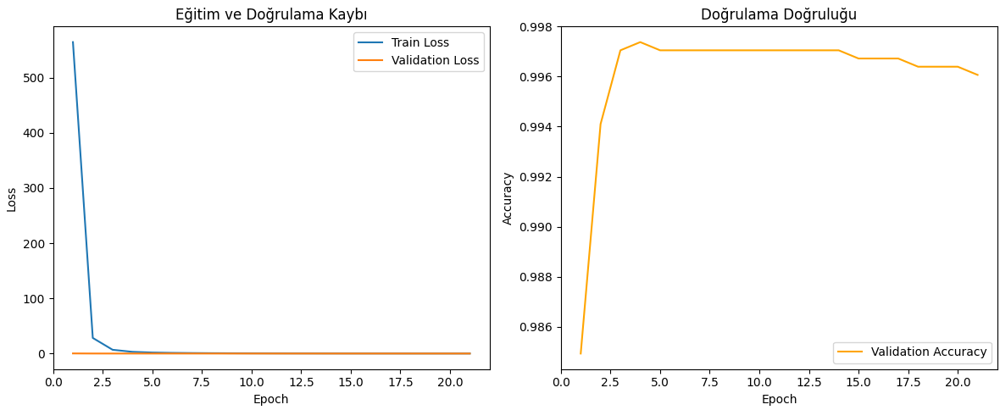
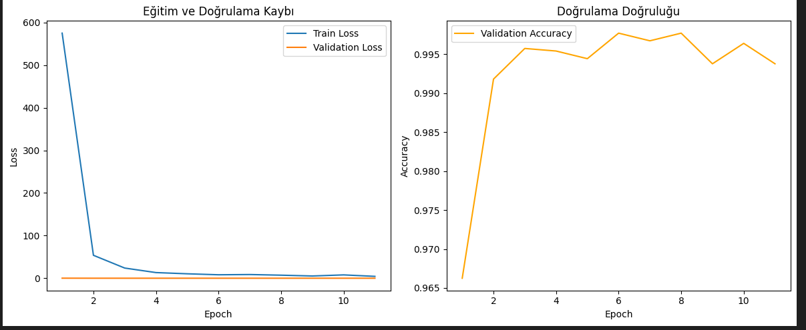
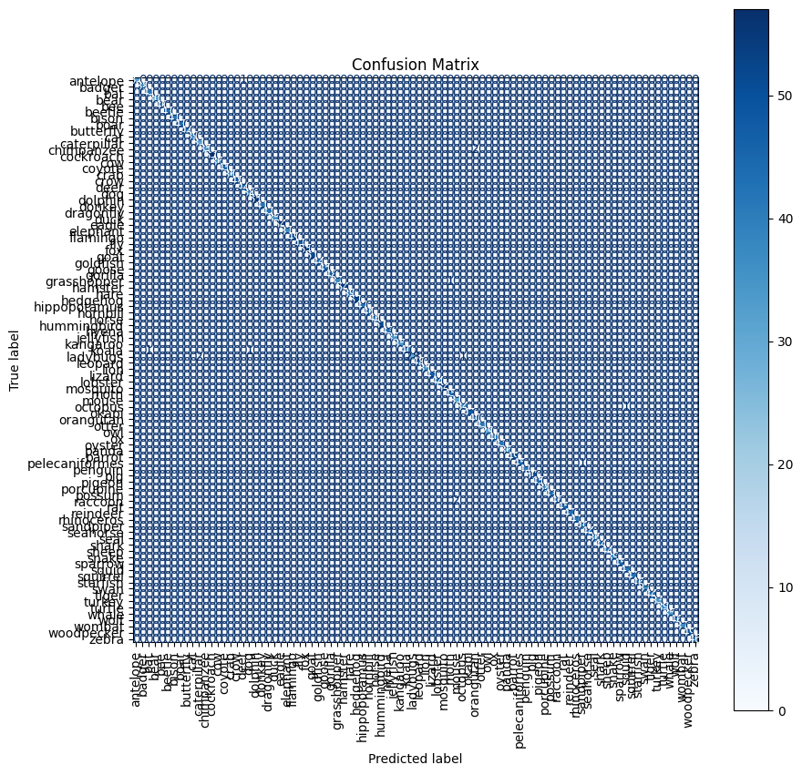

# MultiZoo Animal Classifier

**MultiZoo** is a deep learning-based animal classifier that enables users to upload animal images and receive top-3 classification predictions via a simple **Tkinter GUI**. The application supports two transformer-based vision models: **DeiT** and **SwinV2**, fine-tuned on a custom animal dataset of 90+ classes.

## Project Overview

* **Transformer-based image classification** using [HuggingFace Transformers](https://huggingface.co/docs/transformers)
* Integrated **Tkinter GUI** for non-technical users
* **Switchable models**: Deit (Facebook) & SwinV2 (Microsoft)
* **Offline inference** with pre-trained weights
* Built-in **model performance viewer**
* **Custom data augmentation pipeline** with PyTorch

---

## GUI Demo

| Initial Screen                     | Prediction Screen                        |
| ---------------------------------- | ---------------------------------------- |
|  |  |

---

## Supported Models

| Model           | Source                                      | Architecture Type             | Parameters |
| --------------- | ------------------------------------------- | ----------------------------- | ---------- |
| **DeiT-Base**   | `facebook/deit-base-patch16-224`            | Vision Transformer (ViT)      | 86M        |
| **SwinV2-Tiny** | `microsoft/swinv2-tiny-patch4-window16-256` | Hierarchical Swin Transformer | 28M        |

You can switch between models directly in the GUI.

---

## Features

* Top-3 prediction with confidence scores
* Detailed model metrics (accuracy, precision, recall, F1)
* Offline model loading (no API required)
* Easily extensible for additional models or datasets
* Clean visual interface

---

## Dataset

The custom dataset includes 90+ animal classes:

* `antelope`, `zebra`, `lion`, `horse`, `koala`, `bat`, `flamingo`, `fox`, `shark`, `whale`, etc.
* Preprocessed and augmented using `TorchPreprocessor` with resizing, flips, and jittering
* Structured via `ImageFolder` for PyTorch compatibility

---

## Performance (Sample - DeiT)

```
Accuracy : %99.66
Precision: %99.62
Recall   : %99.61
F1-Score : %99.61
```

> See "Model Bilgisi" button in the app for full classification report.

### Training & Validation Curves

#### **DeiT Training Curves**



#### **SwinV2 Training Curves**



### Confusion Matrix



---

## Training Overview

| Stage             | Description                                                               |
| ----------------- | ------------------------------------------------------------------------- |
| **Preprocessing** | Resizing, normalization, augmentation via `TorchPreprocessor`             |
| **Dataset Split** | 64% Train – 16% Val – 20% Test                                            |
| **Model**         | HuggingFace `AutoModelForImageClassification`                             |
| **Optimization**  | AdamW + CrossEntropyLoss + Early Stopping                                 |
| **Evaluation**    | Accuracy, Precision, Recall, F1, Classification Report + Confusion Matrix |

---

## Technologies Used

| Tool                     | Purpose                           |
| ------------------------ | --------------------------------- |
| **PyTorch**              | Model training and inference      |
| **Transformers**         | DeiT / SwinV2 pre-trained weights |
| **Tkinter**              | GUI framework                     |
| **Pillow**               | Image loading and display         |
| **Seaborn / Matplotlib** | Visualization of results          |

---

## Run the Application

### 1. Install Dependencies

```bash
pip install torch torchvision transformers pillow tqdm
```

### 2. Clone and Prepare

```bash
git clone https://github.com/yourusername/MultiZoo-Classifier.git
cd MultiZoo-Classifier
```

### 3. Download or Train Models

* Pretrained `.pt` models should be placed under:

  ```
  src/model/deit/
  src/model/swin/
  ```
* You can train your own using the training notebooks.

### 4. Run GUI

```bash
python src/user_interface.py
```
---

## Developers

* **Alperen Arda** – [alperen.arda.adem22@gmail.com](mailto:alperen.arda.adem22@gmail.com)
* **Ömer Şimşek** – [omer2020084@gmail.com](mailto:omer2020084@gmail.com)

